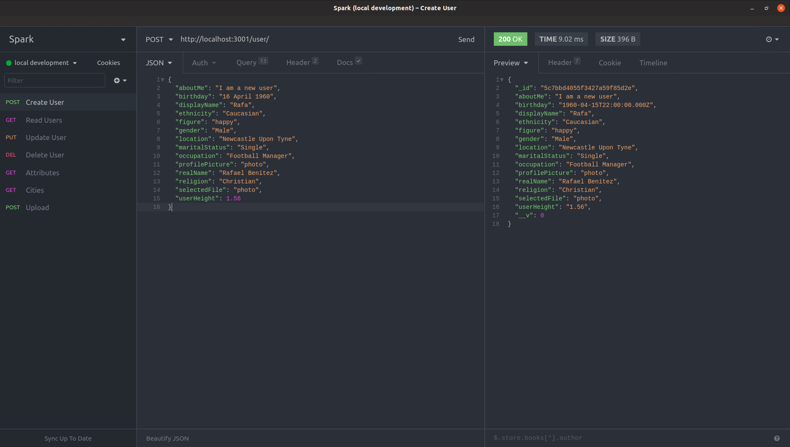
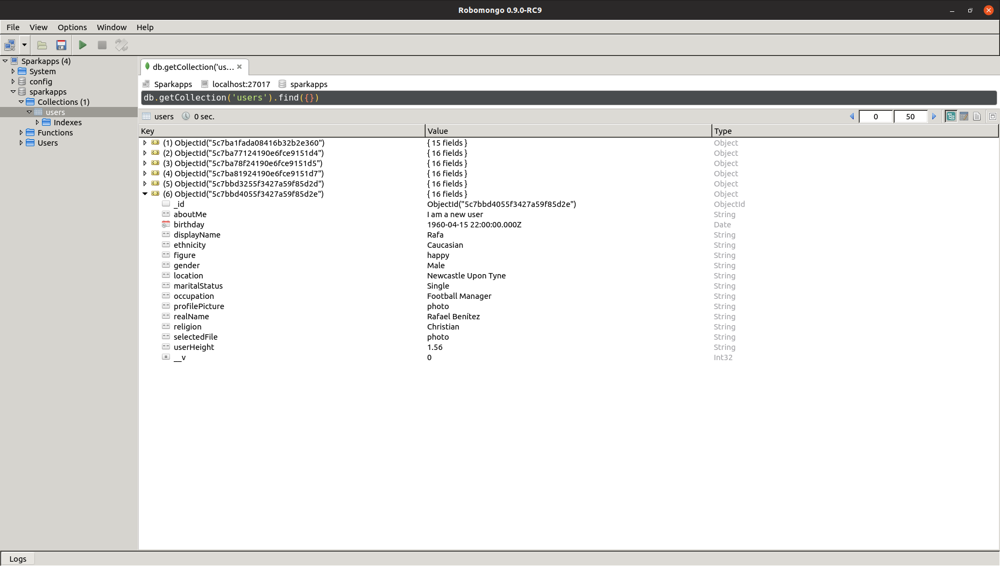

# Spark Editable Profile

Editable Profile project for Spark Networks.

This is a mono repository containing two applications. Each application has it own Dockerfile which the docker compose yaml file uses to build the images, you will use `make` commands to do so.

1. client
2. api

## Client

I have chosen React Js for the front end. I've used `create-react-app` to scaffold the app. I am using SASS (Sass flavour). I am also using Bulma front end framework.

## Api

I am using an express server for the back-end. I used `express-generator` to scaffold the app. using MonogoDB for the database. I am using Docker and docker-compose to manage containers.

I've setup seven routes for the given endpoints, and setup on POST route to save the image. I have also setup a user route to update a user.

| Request  | URI  |   |   |   |
|---|---|---|---|---|
| POST | http://localhost:3001/user/   |   |   |   |
| GET  | http://localhost:3001/user/  |   |   |   |
| PUT  | http://localhost:3001/user/:id  |   |   |   |
| DEL  | http://localhost:3001/user/:id  |   |   |   |
| GET  | http://localhost:3001/user/attributes  |   |   |   |
| GET  | http://localhost:3001/locations/cities  |   |   |   |
| POST | http://localhost:3001/upload  |   |   |   |

## Make

To start run helpful make commands:

```bash
make help
```

### Local development

To start run:

```bash
make up
```

This will bring up three services.

1. API, running on http://localhost:3001
2. Client, running on http://localhost:3000
3. MongoDB, running on mongodb://localhost:27017. A database called `sparkapps` will be created upon first POST to api.

Alternatively you may also try,

```bash
cd /api && npm run dev
cd /client && npm start
```




## Database - MongoDB

Using MongoDB, pull down a instance of mongodb, all handled by scripts do a `make up`.

### Install Docker & Docker Compose

[https://docs.docker.com/install/linux/docker-ce/ubuntu/](www.docs.docker.com/install/linux/docker-ce/ubuntu/d)

[https://docs.docker.com/compose/install/](www.docs.docker.com/compose/install/)

#### Links

[https://facebook.github.io/create-react-app/](https://facebook.github.io/create-react-app/)

[https://bulma.io/](https://bulma.io/)

[https://sass-lang.com/](https://sass-lang.com/)

[https://insomnia.rest/](https://insomnia.rest/)
[https://robomongo.org](https://robomongo.org)